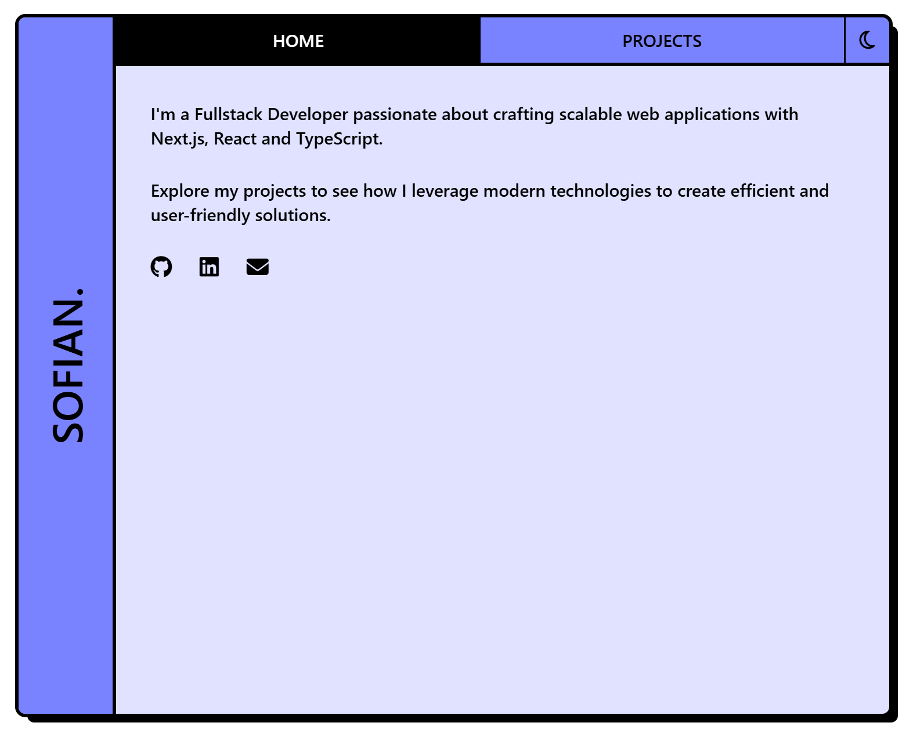

# Portfolio




Un portfolio personnel au style « fenêtre néobrutaliste » construit avec Next.js, React et Tailwind CSS pour présenter mes projets et compétences.

---

## 🌐 Démo en ligne

https://sofianelaloui.me

---

## 🛠️ Stack technique

- **Framework** : Next.js (React + TypeScript)  
- **Styles** : Tailwind CSS
- **Linting & formatage** : ESLint 
- **Hébergement** : Vercel (recommandé)  

---

## 📦 Installation & utilisation
 
   ```bash
   git clone https://github.com/ElSofian/portfolio.git
   cd portfolio
   npm i --legacy-peer-deps
   npm run dev
   ```
